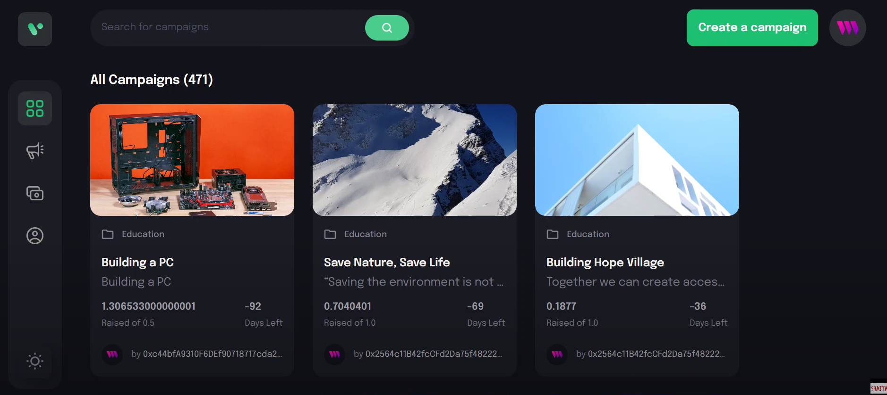
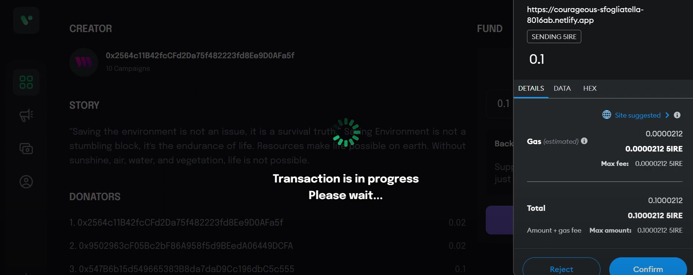
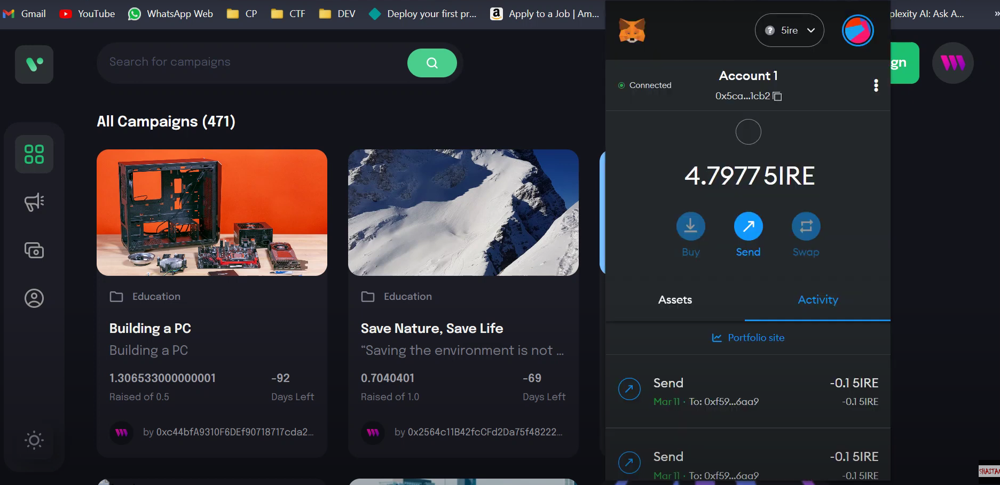
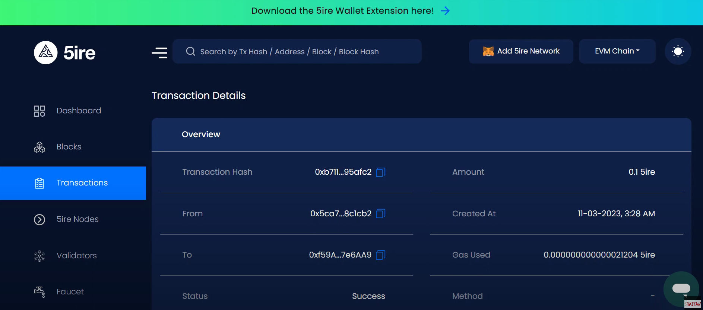
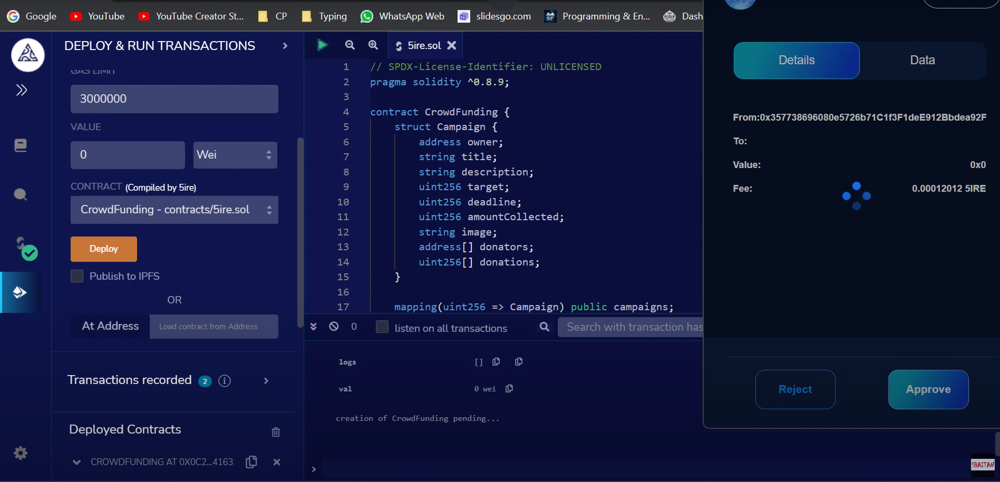

<h1>Team Name - Anonymous</h1>

<h2>Problem Statement - 5ire</h2>

<h2>Theme - Community Crowd Funding </h2>

<H3>Team Members</H3>
<ul>
<li>Ayush</li>
<li>Likhith</li>
<li>Shivank</li>
<li>Vaibhav</li>
<h1>Project Overview</h1>
<h4>Dashboard</h4>

<h4>Funding an Event</h4>

<h4>5ire Transaction Details</h4>

<h4>Tracking Transaction </h4>

<h4>Deployment Process</h4>

<h4>Creating Event</h4>

<h1> Prerequisite Before Running this project offline </h1>
  <b>Inside web3 folder run the following commands</b> 
  <b>npm install hardhat</b> 
  <b>npm run deploy</b> 

Inside client folder run the following commands 
  <b>npx thirdweb create --app</b> 
  <b>npm install react-router-dom</b> 
  <b>npm run dev</b> 

Note :- You must have a 5ire wallet account and metamask extension installed in your browser with account created on it. It is adviced to add some free tokens in order to make transaction and test the application.

<h2> Demo Video Link </h2>
https://www.youtube.com/watch?v=dupdaYG7Hw0
